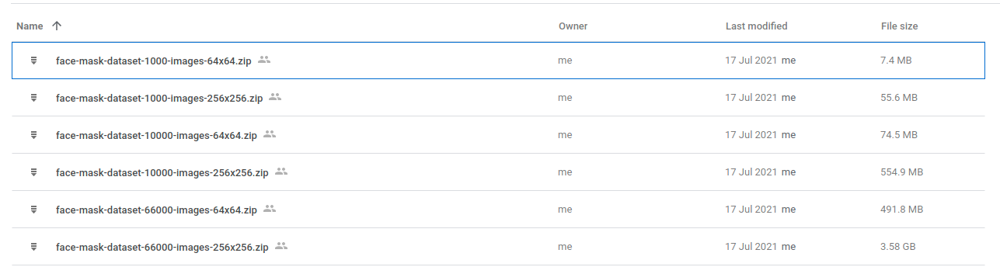

# Mask Detector Program
This program is to detect faces and classify whether people are wearing mask properly.


# Installation
* I recommend to install Anaconda as a package manager
* PyTorch is the deep learning framework I used in this program, so ensure you have it installed in your machine. you can check the installation document [here](https://pytorch.org/get-started/locally/)
* Create an environment using anaconda by executing ```conda create -n maskDetector python=3.8```
* Activate the new environment by ```conda activate maskDetector```
* Navigate to your working directory (root folder)
* Install the other libraries by running ```pip install -r requirements.txt```


# Usage
Below is the steps on how to use this program.

## Download Public Dataset
You can download the dataset [here](https://drive.google.com/drive/folders/1Jwm9qZ58adJo5HEMNtIymLQmu_OcfnxV?usp=sharing). There are several version you can choose to download.


I suggest to choose the [face-mask-dataset-10000-images-64x64.zip](https://drive.google.com/file/d/1IHAEJEGNrmMwhLogbcxEBjAGQUWwYWdl/view?usp=sharing) as it has suffficient images to train the classifier with quite good resolution. You need to download the dataset and put it in the root folder.

## Take Custom Dataset
You may want to take your own dataset using webcam to improve the performance. You need to check the camera ID in [config.ini](config.ini). If you are using a normal webcam without any external camera, the camera_id should be set to 0. After setting up the camera ID, you can simply run 

```python take_dataset.py```

### Shortcut Key for Custom Dataset
| Keyboard | Function |
|---|---|
| q | Close the program |
| 1 | Switch to incorrect_mask state |
| 2 | Switch to mask state |
| 3 | Switch to no_mask state |
| s | Save image to the current state |

## Preprocess Dataset
This step is to combine both public dataset you have downloaded and your own custom dataset. You need to open [preprocess.py](preprocess.py) and check on line 15-21 to match with your configuration. After you are done with the configuration, you can run
```python preprocess.py```

## Train New Model
* Open [train.py](train.py)
* Modify line 16-18 to match your configuration
* You may need to change the batch_size if you don't have enough RAM

## Check config.ini Before Running the Program 
Below is the example of [config.ini](config.ini)
```
[BOOLEAN]
# Boolean value, 0 for false and 1 for true
# SHORT_RANGE works best if objects are within 2m
short_range = 0
debug = 0
save_video = 0

[INT]
width = 640
height = 360
camera_id = 2
interval_second = 30
detection_buffer = 15

[FLOAT]
# PADDING is a scaling factor(0-0.2), best 0.1
padding = 0.09
detection_confidence = 0.5

[LIST]
mean = [0.5288752, 0.48194864, 0.46311542]
std = [0.25156483, 0.2489401, 0.2509675]

[TUPLE]
green = (0, 255, 0)
yellow = (0, 240, 255)
red = (0, 0, 255)
black = (0, 0, 0)

[STRING]
sender_email = nomaskdetected@gmail.com
receiver_emails = van.evanfebrianto@gmail.com, evan.febrianto@supermail.id
password = nomask2021
log_dir = logs
```
You can modify those value and it will automatically be apllied to all the codes. Below are the details of each parameter:
| Parameter | Description |
| --------- | ----------- |
| short_range | If you are testing using a webcam, then use 1 because the object is within 2m to the camera, otherwise you can set to 0 |
| debug | If you want to enter debug mode, you can set to 1 |
| save_video | If you want to save the detection video, set to 1 |
| width | Set camera width |
| height | Set camera height |
| camera_id | The camera id, 0 is for webcam, 1 or 2 is for external camera |
| interval_second | Interval sending email to receivers, minimum is 30 |
| detection_buffer | How many frame you want to wait to save the anomaly result. This also acts as a filter to remove noise in detection process |
| padding | pixel padding scale which is applied to face detection result. The value range is 0 - 0.2, best 0.09. Do not change this after the train process |
| detection_confidence | Confidence threshold for face detection |
| mean | mean value across all dataset. Do not change this, will automatically be calculated after you run [preprocess.py](preprocess.py) |
| std | std value across all dataset. Do not change this, will automatically be calculated after you run [preprocess.py](preprocess.py) |
| green, yellow, red, black | Color configuration in B, G, R |
| sender_email | Email which will be used to send the report |
| receiver_emails | Email recepients. You need to follow the format which is ```email_1, email_2, email_3, email_4``` |
| password | Password for email sender |
| log_dir | Directory to save the detection result |

## Run the Program
After configuring the config.ini, you can now enjoy the program by executing
```python main.py```

